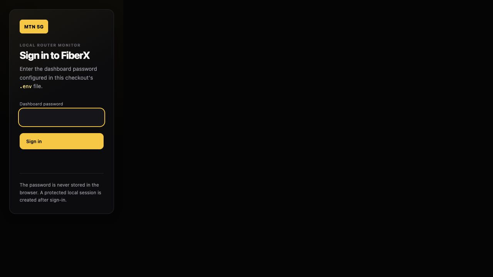
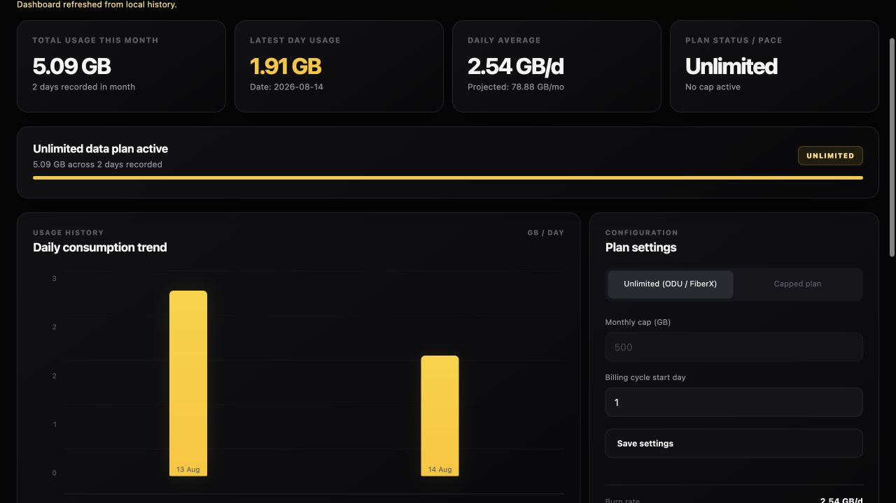

# MTN FiberX Data Tracker

FiberX is a small, local-first dashboard for tracking usage from an MTN FiberX router. It polls the cumulative WAN counters exposed by a Huawei HG8145X7-10 router, turns the counter changes into daily history, and keeps the data on your computer.

It does not use a cloud service, and it does not need a package install.

This project was inspired by [sagenoya/mtn-data-tracker](https://github.com/sagenoya/mtn-data-tracker). FiberX is an independent implementation with its own local storage, authentication, and router-collection behavior.





## What it does

- Records download and upload usage from the router's cumulative WAN counters.
- Shows monthly totals, latest-day usage, daily averages, projections, and a daily chart.
- Lets you switch between an unlimited plan and a capped plan.
- Exports the selected month as CSV.
- Shows connected-device identity and Wi-Fi link details when the router provides them.
- Keeps collecting every 30 seconds while the local server is running, even when the browser is closed.
- Stores history locally in SQLite, with a JSON fallback for recovery.
- Protects the dashboard with a local password and an HttpOnly session cookie.

## Requirements

- Node.js `24.18.1` or newer within the Node 24 LTS line.
- A Huawei router with the WAN statistics endpoints used by MTN FiberX. The project is tested with the HG8145X7-10.
- macOS only if you want to use the included background launcher.

FiberX uses Node's built-in APIs. There is no `npm install` step.

## Quick start

```sh
git clone https://github.com/wtoalabi/mtn_fiberx_counter.git
cd mtn_fiberx_counter
cp .env.example .env
chmod 600 .env
```

Open `.env` and set:

- `DASHBOARD_PASSWORD`: a unique password with at least 20 characters. Do not reuse the router password.
- `ROUTER_URL`, `ROUTER_USERNAME`, and `ROUTER_PASSWORD`: the local router connection details.
- `USAGE_TIMEZONE`: the timezone used when grouping samples into days.

For a self-signed HTTPS certificate, set `ROUTER_TLS_FINGERPRINT256` to the verified SHA-256 fingerprint. Keep `ROUTER_INSECURE_TLS` and `ROUTER_ALLOW_PLAINTEXT_HTTP` set to `false` unless you understand the risk and have no safer option.

Validate the configuration, then start FiberX:

```sh
node server.js --check-config
node server.js
```

Open [http://127.0.0.1:3000](http://127.0.0.1:3000) and sign in with `DASHBOARD_PASSWORD`.

The full setup and usage instructions are in the [user guide](docs/USER_GUIDE.md).

## Run in the background on macOS

The included launcher installs a per-user LaunchAgent and keeps the collector running after the browser is closed:

```sh
./start-fiberx.sh
```

The launcher checks the Node.js version and configuration, starts the service at login, and verifies the local dashboard. Logs are written to `~/Library/Logs/FiberX/`.

## Add a macOS menu-bar icon

The optional menu-bar companion gives you a FiberX icon in the macOS menu bar. Clicking it opens a compact dropdown with total usage this month, today's usage, recent download/upload speed, daily average, projected month-end usage, plan status, router status, and last sync time. The full dashboard is still available as an optional menu action, but it is not needed for routine checks.

Install the background collector first, then build and install the companion:

```sh
./start-fiberx.sh
./macos/install-menubar-app.sh
```

This uses the Swift compiler and AppKit already provided by macOS. It does not require the paid Apple Developer Program. The installer ad-hoc signs the app for use on the Mac where it was built; it is not notarized and is not intended for App Store distribution. If macOS shows a verification warning the first time, control-click `~/Applications/FiberX.app`, choose **Open**, and confirm.

To remove only the menu-bar companion:

```sh
./macos/uninstall-menubar-app.sh
```

The collector, `.env`, local history, and logs are left in place.

## How usage is measured

The router exposes cumulative receive (RX) and transmit (TX) byte counters, not a ready-made monthly history. FiberX samples those counters and records the difference between successful samples. The first successful sample establishes a baseline, so it records zero usage by design. Later samples are grouped by day and month.

If the router resets its counters, FiberX starts a new interval instead of creating a negative usage value. If the computer or router is unavailable, the next successful sample may be labelled as an offline gap; if the router also reset its counters, that missing usage cannot be reconstructed.

The connected-device view reports identity, address, connection type, duration, negotiated link rates, and signal when available. Link rates are not current internet throughput. The tested firmware does not expose per-device byte counters, so the device table normally shows `Not exposed` for per-device usage while the WAN total remains available.

## Privacy and security

FiberX binds to `127.0.0.1`, keeps router credentials on the local machine, and stores history in the local `data/` directory. `.env` and `data/` are ignored by Git. Never commit them, exported CSV files, logs, or screenshots containing device names, IP addresses, or MAC addresses.

Read [SECURITY.md](SECURITY.md) before opening a security issue. MTN and Huawei names identify compatible equipment; this project is not affiliated with either company.

## Disclaimer, non-affiliation, and indemnity

FiberX is an independent, community-developed open-source project. It is not created, sponsored, endorsed, authorized, maintained, or supported by MTN Nigeria, MTN Group, Huawei, or any other network operator, carrier, or router manufacturer. “MTN FiberX”, “MTN”, “Huawei”, and related names and marks belong to their respective owners and are used only to identify the service and equipment this project is designed to work with.

FiberX does not connect to MTN’s customer systems or represent itself as an official MTN integration. It reads counters exposed by a compatible local router interface. No permission, endorsement, or authorization from MTN is implied or granted by this repository. Use FiberX only with a router, connection, credentials, and network that you own or are authorized to monitor. Check the terms that apply to your service and equipment before using, modifying, or distributing it.

This software is provided “as is”, without warranties of any kind. The maintainers and contributors are not responsible for service interruption, inaccurate or incomplete usage records, router lockouts, lost data, security incidents caused by local configuration, or any loss resulting from use or inability to use the project. Do not rely on FiberX as an official billing record or as a substitute for information provided by your network operator.

To the maximum extent permitted by applicable law, you agree to indemnify, defend, and hold harmless the maintainers and contributors from claims, damages, losses, liabilities, costs, and expenses (including reasonable legal fees) arising from your use, modification, deployment, or distribution of FiberX; your failure to obtain required authorization; your violation of applicable law or service terms; or your misuse of the project. This does not exclude or limit liability that cannot lawfully be excluded or limited. Consider obtaining legal advice before deploying FiberX for a business, public service, or other third-party use.

## Development

The application is dependency-free. A lightweight syntax check is available:

```sh
npm run check
```

Please keep credentials, router responses, local databases, and personal device information out of commits and issue attachments.

## License

FiberX is released under the [MIT License](LICENSE).
